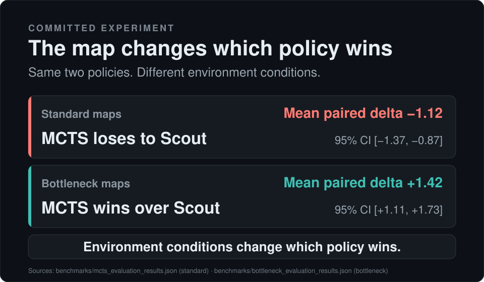

<p align="center">
  
</p>

# Lattice

<p align="center"><strong>Auditable multi-agent experiments, from seeded run to replayable evidence.</strong></p>

<p align="center">
  <a href="https://github.com/candavere/lattice/actions/workflows/ci.yml"></a>
  
  
</p>

Lattice is a headless .NET 8 environment where every run is seeded, comparisons
are mirror-seated with a confidence interval, and partial observability,
dynamic topology, and resource contention are first-class. Replay re-derives
the simulation from a recording and verifies each step's serialized result,
and every claim on this page links to the committed artifact that produced it.

Two ways in: **[run your first experiment](#run-your-first-experiment)** or
**[inspect the evidence](#inspect-the-evidence)**.

<p align="center">
  
</p>

## Proof strip

| Claim | Exact scope | Evidence |
| :--- | :--- | :--- |
| **99.61% scoped mutation score** | `Simulation.cs` + `PerceptionFilter.cs` only, Stryker.NET 5.0.0 — 252 killed / 1 timed out / 1 survived / 0 no-coverage (241 ignored, 25 compile-error; score is (killed + timeout) ÷ (killed + survived + timeout + noCoverage)). Not whole-repository coverage. | [`benchmarks/mutation_stryker_summary.json`](benchmarks/mutation_stryker_summary.json), [FINDING-007](docs/FINDINGS_LEDGER.md#finding-007--edgechoke-not-found-path-uncovered-fuzz-harness-kill-attribution-is-batch-state-dependent) |
| **Per-step serialized `StepResult` replay equivalence** | Canonical golden trajectory [`Tests/fixtures/golden_trajectory.jsonl`](Tests/fixtures/golden_trajectory.jsonl), verified on the tested Ubuntu, macOS, and Windows CI matrix. Per-step equality — not byte identity, not a state hash. | [`.github/workflows/ci.yml`](.github/workflows/ci.yml) replay-verify step |
| **Paired 95% confidence intervals, negative result kept** | 32-rollout MCTS vs Scout, mirror-seated. Standard dev Δ −1.12 [−1.37, −0.87] (FAIL). Bottleneck dev Δ +1.42 [+1.11, +1.73] (PASS). | [`benchmarks/mcts_evaluation_results.json`](benchmarks/mcts_evaluation_results.json), [`benchmarks/bottleneck_evaluation_results.json`](benchmarks/bottleneck_evaluation_results.json) |

## What Lattice reveals

The same policy, two map distributions, one flipped conclusion.

| Distribution | Policy | Mean paired Δ | 95% CI | Verdict | Evidence |
| :--- | :--- | ---: | --- | :--- | :--- |
| Standard generated maps (dev, 50 seeds) | MCTS (32 rollouts) vs Scout | −1.12 | [−1.37, −0.87] | FAIL — MCTS loses | [`benchmarks/mcts_evaluation_results.json`](benchmarks/mcts_evaluation_results.json) |
| Procedural bottleneck maps (dev, 30 seeds) | same policy, same budget | +1.42 | [+1.11, +1.73] | PASS — MCTS wins | [`benchmarks/bottleneck_evaluation_results.json`](benchmarks/bottleneck_evaluation_results.json) |

The 32-rollout MCTS policy loses to the deterministic Scout heuristic on open
generated maps, then wins when both agents are funneled through a capacity-1
choke into one shared vault. Topology changed the conclusion. The loss is a
committed result, not a bug: it is the baseline any future policy must beat
under the identical protocol.

> **The environment is the product. Policies are evaluation subjects, and
> negative results remain evidence.**

Held-out suites, protocol details, hardware provenance, and limitations live in
[Research findings](#research-findings).

## Run your first experiment

You need the [.NET 8 SDK](https://dotnet.microsoft.com/download). Lattice also
runs on .NET 9/10 via `RollForward=LatestMajor`.

The fastest path is the fixed Dungeon Infiltration & Sentry Patrol scenario — a
patrolling guard chases a heister through a capacity-gated dungeon under
partial observation:

```sh
dotnet run --project Cli -- simulate --seed 42 --scenario infiltration --steps 100 --out infiltration.jsonl
```

`infiltration.jsonl` is one JSONL line per tick: the header embeds the seeded
map and simulation config, and each line is that tick's recorded actions and
`StepResult`. Render it:

```sh
dotnet run --project Cli -- render --trajectory infiltration.jsonl --format svg --out infiltration.svg
```

`infiltration.svg` is a self-contained, dependency-free animated SVG — no
browser plugins, no external assets. Now prove the recording is honest:

```sh
dotnet run -c Release --project Cli -- replay infiltration.jsonl --verify
```

`--verify` rebuilds a fresh simulation from the trajectory header, feeds each
recorded turn of actions back through the engine, and compares every
re-serialized `StepResult` against the recorded one. Exit code `0` means every
tick reproduced. That is the replay contract, and it is the same check the CI
pipeline runs against the golden trajectory on Ubuntu, macOS, and Windows.

For a seeded two-agent sampling run instead (MCTS vs Random, no scenario):

```sh
dotnet run --project Cli -- simulate --seed 42 --agent mcts --steps 30 --out demo.jsonl
dotnet run --project Cli -- render --trajectory demo.jsonl
```

Every command is seeded. Identical arguments produce identical per-step
serialized output under the specified .NET 8 BCL runtime contract.

The full command set is `generate`, `simulate`, `render`, `analyze`, `replay`,
`benchmark`, and `evaluate` — a compact reference is in the
[Reference](#reference) section, and the complete flag-by-flag reference lives
in [`docs/CLI.md`](docs/CLI.md).

## Inspect the evidence

Each committed artifact below is the exact file behind a claim on this page:

| Artifact | What it is | Sub-claims it backs |
| :--- | :--- | :--- |
| [`docs/SUPPORT_AND_REPRODUCIBILITY.md`](docs/SUPPORT_AND_REPRODUCIBILITY.md) | The operational contract: what is supported, what is not, the four-equivalence vocabulary | Replay equivalence, determinism boundary, support matrix |
| [`docs/INVARIANT_SPECIFICATION.md`](docs/INVARIANT_SPECIFICATION.md) | Formal, implementation-agnostic transition and perception laws plus falsifiable challenge questions | Capacity gates, conflict resolution, perception boundary, replay contract |
| [`benchmarks/mcts_evaluation_results.json`](benchmarks/mcts_evaluation_results.json) | Standard-map paired study, dev + held-out | Negative baseline, Δ, CI, verdict |
| [`benchmarks/bottleneck_evaluation_results.json`](benchmarks/bottleneck_evaluation_results.json) | Contention-bearing paired study, dev + held-out | Topology-dependent inversion |
| [`benchmarks/throughput_benchmark.json`](benchmarks/throughput_benchmark.json) | Five-workload timing record on one host | Performance, qualified |
| [`benchmarks/mutation_stryker_summary.json`](benchmarks/mutation_stryker_summary.json) | Stryker run summary with survivor classification | Mutation score, scope |
| [`docs/reproduction_packet.md`](docs/reproduction_packet.md) | Turnkey guide to verifying the published `v2.3.2` release asset-for-asset | Release claims, checksums |
| [`docs/FINDINGS_LEDGER.md`](docs/FINDINGS_LEDGER.md) | Append-only record of criticisms, edge cases, and resolved issues | Governance, traceability |
| [`docs/CLAIM_CALIBRATION_MATRIX.md`](docs/CLAIM_CALIBRATION_MATRIX.md) | Every public claim → its proving artifact, tested matrix, and boundary | Claim-to-artifact traceability |

## Why Lattice

Multi-agent claims live on a spectrum between "we ran it once somewhere" and
"here is the run, the seed, and the reproducible harness." Lattice points at
the second end. The environment, the replay contract, the evaluation harness,
and the committed evidence trail are the product; policies are evaluation
subjects.

That framing makes negative results ordinary. A benchmark gate that only
surfaces successes teaches a repository to hide losses. Lattice keeps FAIL
verdicts in the committed record — the standard-suite loss to Scout is a
reference point, not an embarrassment, and any future policy supersedes it by
clearing the same rule on the same suites.

The engine is a pure step contract: each tick is a function of the prior state
and the recorded actions, with no hidden state, no singletons, and no ambient
randomness. Because everything is seeded and everything records, a run is a
stable object you can inspect, fork from tick K, or hand to a reviewer.

**Status: Research Preview.** Lattice is under evaluation by maintainers and
collaborators and is not qualified for production or critical-infrastructure
use. It is not game middleware, and MCTS is one evaluation subject here, not
the product.

## How it works

Four ideas carry the whole design:

1. **Maps are graphs.** Zones (nodes), chokes (edges with capacity),
   resources. Same-tick entry gates triage occupancy in priority-rank order.
2. **The step contract is the only state change.** Replay rebuilds from the
   header and verifies per-step serialized `StepResult` equality.
3. **Observation is a projection, not a core change.** `PerceptionFilter`
   masks a complete state per observer — `Observed` / `Stale` / `Unknown` with
   timestamps, computed by graph reachability, not Euclidean distance.
4. **Topology may change during a run.** Timed portcullis and event-locked
   choke rules flow through rollouts, recordings, contention reporting, and
   replay verification.

<details>
<summary><strong>Contracts in more detail</strong></summary>

Step resolution order, the topological graph space, kinematic edge transit,
dynamic topology, bounded perception, immutable forking, the Dungeon
Infiltration & Sentry Patrol scenario, and map-fairness measurement are
spelled out with their enforcement tests in
[`docs/MECHANICS.md`](docs/MECHANICS.md).

</details>

## Research findings

### Standard maps: MCTS loses, and that is the committed baseline

Reference result: `benchmarks/mcts_evaluation_results.json` (source revision
`5783ca1`, Apple M1 / 8 cores / .NET 10.0.10, MCTS 32 rollouts × depth 12,
2 agents / 200 ticks / transit speed 4, baseline `ScoutCollectorAgent` with
unbounded vision, mirror-seated per seed).

| Suite | Seeds | Mean Δ | 95% CI | Win | Draw | Loss | Timeout | Verdict |
| :--- | ---: | ---: | :--- | ---: | ---: | ---: | ---: | :--- |
| dev (1001–1050) | 50 | −1.12 | [−1.37, −0.87] | 15% | 27% | 58% | 0% | **FAIL** |
| held-out (2001–2050) | 50 | −1.25 | [−1.54, −0.96] | 18% | 14% | 68% | 0% | **FAIL** |

The entire 95% CI sits below 0 on both suites, so the decision rule fails by a
wide margin. Every suite run terminates at `resources-exhausted` on ≤ 200
ticks; contention stays at 0, because generated maps never put both agents on
the same claim path. This measures policy speed on open layouts — the scout's
back-pressure-aware collection beats this budget's shallow lookahead.

**This failure is the committed baseline.** Any future search or learning
policy must clear the rule (mean paired Δ > 0 and CI lower bound > 0) on the
same suites, seeds, and budget to supersede it. To challenge the result: raise
the budget (`--rollouts 64`), change the map distribution, or swap the
baseline — every run records its own delta, CI, and verdict.

### Bottleneck maps: the same policy inverts

Reference result: `benchmarks/bottleneck_evaluation_results.json` (source
revision `1c6fa80`, identical policy budget and baseline, procedural
contention topology family, first 30 dev + 30 held-out seeds).

| Suite | Seeds | Mean Δ | 95% CI | Win | Draw | Loss | Timeout | Contention | Verdict |
| :--- | ---: | ---: | :--- | ---: | ---: | ---: | ---: | ---: | :--- |
| dev (1001–1030) | 30 | +1.42 | [+1.11, +1.73] | 55% | 8% | 37% | 0% | 22% | **PASS** |
| held-out (2001–2030) | 30 | +1.38 | [+1.07, +1.69] | 53% | 23% | 23% | 0% | 27% | **PASS** |

Each seed draws a distinct topology — choke placement, corridor layout,
vault resource distribution — while both spawn arms stay geometric mirror
images, so both agents reach the shared single-lane gate on the same tick and
actively contend. Under that pressure the same MCTS budget wins. This does
**not** supersede the standard-suite negative baseline; the two are
complementary evidence on different map distributions. See
[`docs/SUPPORT_AND_REPRODUCIBILITY.md`](docs/SUPPORT_AND_REPRODUCIBILITY.md)
for the protocol and [`docs/FINDINGS_LEDGER.md`](docs/FINDINGS_LEDGER.md)
for the negative-result record.

### Performance, qualified

Speed is measured, not advertised. The committed
[`benchmarks/throughput_benchmark.json`](benchmarks/throughput_benchmark.json)
records five workloads — raw stepping, mixed static facility, dynamic
contention, stress topology, and MCTS decisions — on one host (Apple M1 /
8 cores / 8 GiB RAM, macOS 27.0.0, .NET 10.0.10 Release, Workstation GC, tree
`b7459a1`). Median throughput spans from 9,145 steps/s on the 30-zone stress
case to 653,736 steps/s on the micro case; the MCTS case reports decisions/s,
and the number that matters to you depends on your workload. Numbers vary with
hardware and build profile. The CI regression gate in
`.github/workflows/benchmarks.yml` re-benchmarks the matrix and fails on a
>20% regression when the host fingerprint matches. The full protocol,
reproduction commands, and the honest-reading notes are in
[`docs/BENCHMARKING.md`](docs/BENCHMARKING.md); work-load medians and
latency/alloc breakdowns are in
[`benchmarks/throughput_summary.md`](benchmarks/throughput_summary.md).

## Who it is for

- **Multi-agent and systems researchers** — seeded, mirror-seated paired
  evaluations of decision policies with confidence intervals and negative
  results kept as evidence.
- **Reinforcement-learning engineers** — a deterministic, contention-bearing
  step-contract environment for benchmarking lookahead planners before any
  distributed training loop.
- **.NET and systems programmers** — high-throughput, low-allocation C# on
  standard BCL primitives with zero third-party runtime dependencies.

Coming from OpenAI Gym or PettingZoo? The step-contract surface maps onto the
classic RL loop — see [`docs/ECOSYSTEM.md`](docs/ECOSYSTEM.md) for the bridge.

## Reference

`Lattice.Cli` exposes seven commands. Run any of them with
`dotnet run --project Cli -- <command> ...`; the binary name is `lattice`.
Every command is seeded, and exit status is `0` on success, non-zero on a bad
argument or runtime error.

| Command | Purpose | Key flags |
| :--- | :--- | :--- |
| `generate` | Write a valid seeded map | `--seed`, `--min-fairness`, `--out` |
| `simulate` | Record an episode as JSONL | `--seed`, `--steps`, `--agent`, `--scenario`, `--rules`, `--out` |
| `render` | Replay a recording as ASCII or SVG | `--trajectory`, `--format`, `--out` |
| `analyze` | Report on a recording (contention, pathing, heatmaps) | `--trajectory`, `--out` |
| `replay` | Replay and optionally verify per-step serialized equivalence | `<file>`, `--verify`, `--out` |
| `benchmark` | Run the five-case workload matrix | `--runs`, `--warmup`, `--commit`, `--cpu`, `--out` |
| `evaluate` | Mirror-seated paired MCTS study | `--seed-set`, `--rollouts`, `--seeds`, `--scenario`, `--out` |

The full flag-by-flag reference — every flag, its description, semantics, and
worked examples — lives in [`docs/CLI.md`](docs/CLI.md).

## Trust, boundaries, and further reading

- **Development and verification method.** Lattice is developed through
  AI-assisted implementation under human direction, architectural
  specification, and review. Claims enter the repository only when they map to
  committed code, deterministic tests, CI workflows, or benchmark artifacts;
  AI assistance is an authoring method, never independent validation.
- **Determinism boundary.** Determinism holds under the specified .NET 8 BCL
  runtime contract. Replays assert per-step serialized `StepResult`
  equivalence. The repository makes no claim of a canonical simulation-state
  hash tree, and raw file-byte identity is not asserted across heterogeneous
  hosts.
- **Research preview.** Not qualified for production or critical-infrastructure
  use. The supported matrix and operational boundaries live in
  [`docs/SUPPORT_AND_REPRODUCIBILITY.md`](docs/SUPPORT_AND_REPRODUCIBILITY.md).
- **Independent replication.** Verify the published `v2.3.2` release
  asset-for-asset — no source build required for three of the four experiments
  — via [`docs/reproduction_packet.md`](docs/reproduction_packet.md), governed
  by [`docs/VALIDATION_PLAN.md`](docs/VALIDATION_PLAN.md).
- **Governance.** [`docs/FINDINGS_LEDGER.md`](docs/FINDINGS_LEDGER.md) records
  criticisms, edge cases, and resolved issues;
  [`docs/CLAIM_CALIBRATION_MATRIX.md`](docs/CLAIM_CALIBRATION_MATRIX.md) maps
  every public claim to its proving artifact, tested matrix, and boundary.
- **Design decisions.** Architecture decision records in
  [`docs/adr/`](docs/adr/) explain why the contracts are shaped as they are —
  product thesis and evidentiary standards, graph-over-grid maps, the
  two-phase step resolution plus perception/transit/forking addenda, and
  mirrored-seat spawn fairness.
- **Related.** [Contributing](CONTRIBUTING.md) · [License](LICENSE) ·
  [Security](SECURITY.md) · [Live demo](https://candavere.github.io/lattice/).