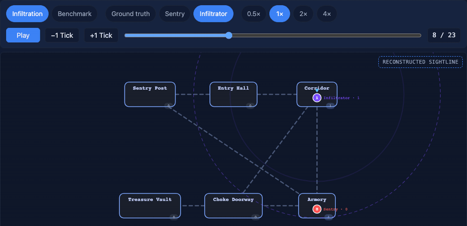

<p align="center">
  
</p>

# Lattice

<p align="center"><strong>Auditable multi-agent experiments, from seeded run to replayable evidence.</strong></p>

<p align="center">
  
</p>

<p align="center">
  <a href="https://github.com/candavere/lattice/actions/workflows/ci.yml"></a>
  <a href="https://github.com/candavere/lattice/actions/workflows/benchmarks.yml"></a>
  
</p>

## Why Lattice exists

Multi-agent claims live on a spectrum between "we ran it once somewhere" and
"here is the run, the seed, and the reproducible harness", and Lattice is built
for the second end. Every run is seeded, every recording can be replayed and
verified step by step, and every number on this page links to the committed
artifact that produced it. A negative result is first-class evidence here, not
something to hide, because the product is the auditable environment plus its
evidence trail, not any single policy.

Two ways in: visitors, start at [Part 1](#part-1-for-a-first-time-visitor).
Reviewers, jump to [Part 2](#part-2-for-reviewers).

---

# Part 1: For a first-time visitor

## What it is

Lattice is a headless .NET 8 environment for deterministic Dec-POMDP-style
multi-agent experiments under partial observability, dynamic topology, and
resource contention. A run is a pure step contract: each tick is a function of
the prior state and the recorded actions, with no hidden state, no singletons,
and no ambient randomness. Every command is seeded, so a run is a stable
object you can inspect, fork from tick K, or hand to a reviewer.

The environment is the product; policies are evaluation subjects. Lattice is an
auditable research and benchmarking environment, not game middleware, and MCTS
is one evaluation subject here, not the product.

> **The environment is the product. Policies are evaluation subjects, and
> negative results remain evidence.**

## Live demo

[Replay the infiltration recording in your browser](https://candavere.github.io/lattice/).
The page replays committed recordings only: ground truth shows everything a
recording carried, and an agent view dims what that agent could not have
reached. Nothing is recomputed from a new simulation in your browser.

## 60-second quickstart

You need the [.NET 8 SDK](https://dotnet.microsoft.com/download). Lattice also
runs on .NET 9/10 via `RollForward=LatestMajor`.

```sh
./setup.sh              # macOS/Linux: verify SDK, restore, build, test,
                        # reproduce one committed claim. Windows: .\setup.ps1
dotnet run -c Release --project Cli -- replay Tests/fixtures/golden_trajectory.jsonl --verify
dotnet run --project Cli -- simulate --seed 42 --scenario infiltration --steps 100 --out infiltration.jsonl
dotnet run --project Cli -- render --trajectory infiltration.jsonl --format svg --out infiltration.svg
```

`infiltration.jsonl` is one JSONL line per tick: the header embeds the seeded
map and simulation config, and each line is that tick's recorded actions and
`StepResult`. The SVG is a self-contained animated render. `replay --verify`
rebuilds a fresh simulation from the trajectory header, feeds each recorded
turn of actions back through the engine, and compares every re-serialized
`StepResult` against the recorded one; exit code `0` means every tick
reproduced. That is the replay contract, and it is the same check the CI
pipeline runs on the golden trajectory on Ubuntu, macOS, and Windows.

`setup.sh` and `setup.ps1` also run a one-command reproduce: they run one
existing benchmark or replay command and compare its output to the committed
artifact, printing `Reproduced: <claim> matches <artifact>` or a clear
mismatch. They are idempotent, use no `sudo`, and never install system
software. `make setup` is equivalent on macOS/Linux.

## Results at a glance

Each row is one committed benchmark claim, with the artifact behind it. The
full raw numbers are in [Part 2](#part-2-for-reviewers).

| Finding | Artifact |
| :--- | :--- |
| 32-rollout MCTS loses to the deterministic Scout heuristic on standard generated maps: mean paired delta -1.12, 95% CI [-1.37, -0.87] on the dev suite. This loss is the committed negative baseline. | [`benchmarks/mcts_evaluation_results.json`](benchmarks/mcts_evaluation_results.json) |
| The same 32-rollout MCTS policy wins when both agents are funneled through capacity-1 chokepoints into one shared vault: +1.42, CI [+1.11, +1.73] on the dev suite. Topology changed the conclusion. | [`benchmarks/bottleneck_evaluation_results.json`](benchmarks/bottleneck_evaluation_results.json) |
| 99.61% scoped mutation score on `Simulation.cs` + `PerceptionFilter.cs` only (252 killed / 1 timed out / 1 survived / 0 no-coverage). Not whole-repository coverage. | [`benchmarks/mutation_stryker_summary.json`](benchmarks/mutation_stryker_summary.json) |
| Five-workload throughput record on one host: median 9,145 to 653,736 steps/s depending on workload (the MCTS case reports decisions/s). Speed is measured, not advertised. | [`benchmarks/throughput_benchmark.json`](benchmarks/throughput_benchmark.json), [`benchmarks/throughput_summary.md`](benchmarks/throughput_summary.md) |

---

# Part 2: For reviewers

## Raw numbers

The reference result for the standard study is
[`benchmarks/mcts_evaluation_results.json`](benchmarks/mcts_evaluation_results.json):
source revision `5783ca1`, Apple M1 / 8 cores / .NET 10.0.10, MCTS 32 rollouts
x depth 12, 2 agents / 200 ticks / transit speed 4, baseline
`ScoutCollectorAgent` with unbounded vision, mirror-seated per seed. The
protocol facts are reproduced by `Cli/CliApp.cs` (evaluation config) and
`Agents/MctsAgent.cs` (default search depth).

| Suite | Seeds | Mean delta | 95% CI | Win | Draw | Loss | Timeout | Verdict |
| :--- | ---: | ---: | :--- | ---: | ---: | ---: | ---: | :--- |
| dev (1001-1050) | 50 | -1.12 | [-1.37, -0.87] | 15% | 27% | 58% | 0% | **FAIL** |
| held-out (2001-2050) | 50 | -1.25 | [-1.54, -0.96] | 18% | 14% | 68% | 0% | **FAIL** |

The entire 95% CI sits below 0 on both suites, so the decision rule fails by a
wide margin. Every suite run terminates at `resources-exhausted` on at most
200 ticks; contention stays at 0, because generated maps never put both agents
on the same claim path. This measures policy speed on open layouts: the
scout's back-pressure-aware collection beats this budget's shallow lookahead.

**This failure is the committed baseline.** Any future search or learning
policy must clear the rule (mean paired delta > 0 and CI lower bound > 0) on
the same suites, seeds, and budget to supersede it. To challenge the result:
raise the budget (`--rollouts 64`), change the map distribution, or swap the
baseline, and every run records its own delta, CI, and verdict.

The reference result for the bottleneck study is
[`benchmarks/bottleneck_evaluation_results.json`](benchmarks/bottleneck_evaluation_results.json):
source revision `1c6fa80`, identical policy budget and baseline, procedural
contention topology family, first 30 dev + 30 held-out seeds.

| Suite | Seeds | Mean delta | 95% CI | Win | Draw | Loss | Timeout | Contention | Verdict |
| :--- | ---: | ---: | :--- | ---: | ---: | ---: | ---: | ---: | :--- |
| dev (1001-1030) | 30 | +1.42 | [+1.11, +1.73] | 55% | 8% | 37% | 0% | 22% | **PASS** |
| held-out (2001-2030) | 30 | +1.38 | [+1.07, +1.69] | 53% | 23% | 23% | 0% | 27% | **PASS** |

Each seed draws a distinct topology, while both spawn arms stay geometric
mirror images, so both agents reach the shared single-lane gate on the same
tick and actively contend. Under that pressure the same MCTS budget wins. This
does **not** supersede the standard-suite negative baseline; the two are
complementary evidence on different map distributions.

Performance, qualified. The committed
[`benchmarks/throughput_benchmark.json`](benchmarks/throughput_benchmark.json)
records five workloads, raw stepping, mixed static facility, dynamic
contention, stress topology, and MCTS decisions, on one host (Apple M1 / 8
cores / 8 GiB RAM, macOS 27.0.0, .NET 10.0.10 Release, Workstation GC, tree
`b7459a1`). Median throughput spans from 9,145 steps/s on the 30-zone stress
case to 653,736 steps/s on the micro case; the MCTS case reports decisions/s.
The per-workload latency and allocation breakdowns, the protocol, and the
honest-reading notes are in
[`benchmarks/throughput_summary.md`](benchmarks/throughput_summary.md) and
[`docs/BENCHMARKING.md`](docs/BENCHMARKING.md). Numbers vary with hardware and
build profile.

## Benchmark gates

Where this page describes a gate, the code is authoritative and the reference
below is exact (file and line). Two places where a committed doc and the code
disagree are called out below rather than resolved.

- **Evaluation verdict gate.** A paired study passes only when both conditions
  hold: the mean paired delta is strictly positive **and** the lower bound of
  the 95% two-sided t-confidence interval is strictly positive, on at least 30
  seeds. `Agents/PairedEvaluation.cs:144-145` enforces
  `graded = deltas.Length >= 30` and `passed = graded && mean > 0.0 &&
  ciLower > 0.0`; the interval uses `ConfidenceLevel = 0.95`
  (`Agents/PairedEvaluation.cs:74`, computed at line 127). The committed
  artifacts carry the resulting `Passed` and `Decision` fields. The protocol
  doc describes exactly this rule
  ([`docs/SUPPORT_AND_REPRODUCIBILITY.md`](docs/SUPPORT_AND_REPRODUCIBILITY.md),
  section 5), so doc and code agree here.
- **Replay equivalence gate.** `.github/workflows/ci.yml:31-32` runs
  `dotnet run -c Release --project Cli -- replay Tests/fixtures/golden_trajectory.jsonl --verify`
  on Ubuntu, macOS, and Windows. `Trajectories/TrajectoryReplay.cs:57`
  (`Verify`) rebuilds a fresh simulation from the trajectory header, re-feeds
  each recorded turn, and compares re-serialized `StepResult`s against the
  recorded ones (`TrajectoryReplay.cs:81-82`). This is per-step serialized
  equivalence, not byte identity and not a state hash.
- **Benchmark regression gate.** `.github/workflows/benchmarks.yml:77-107`
  re-benchmarks the five-case matrix and compares it against the committed
  baseline with `compare_benchmarks.py`, failing when a current workload
  median falls below its threshold times the baseline median. The explicit
  thresholds in the workflow are 0.75 global, 0.6 for `micro_raw_2agent`, and
  0.85 for `policy_lookahead_mcts_32` (`benchmarks.yml:88-90`); otherwise the
  threshold is derived statistically from the baseline's own dispersion
  (`.github/workflows/compare_benchmarks.py:96-112`), with the CLI default
  floor at 0.8 (`compare_benchmarks.py:232`). The gate adjudicates only when
  the host fingerprint (OS family + architecture + .NET runtime major)
  matches (`compare_benchmarks.py:116-131`), and it re-measures once to rule
  out shared-runner jitter (`benchmarks.yml:94-107`).
  **Doc-vs-code conflict:** this README and
  [`benchmarks/throughput_summary.md`](benchmarks/throughput_summary.md)
  previously described the gate as failing on "a >20% regression". The
  enforced ratios above are 0.75, 0.6, and 0.85 plus per-workload derived
  tolerances, which do not all equal a 20% drop. Both statements are recorded
  here; the workflow and comparator are the authority.
- **Mutation gate.** `stryker-config.json:22-26` sets Stryker thresholds
  `high: 80`, `low: 60`, `break: 0`. The only threshold the tool enforces is
  `break`, so the committed gate fails only at a 0% score; `high`/`low` are
  informational. There is no mutation step in CI (`.github/workflows/ci.yml`
  runs restore, build, replay-verify, test, and the UI regression only). The
  99.61% figure is a committed calibration record, not a CI gate.

## Negative results and known limits

Only claims the repository can back up are listed here.

- **The standard-suite loss is committed, not a bug.** The 32-rollout MCTS
  policy loses to the deterministic Scout heuristic on standard generated maps
  (`benchmarks/mcts_evaluation_results.json`). It is the baseline any future
  policy must beat under the identical protocol.
- **What the site calls "fog" was never recorded.** The committed recordings,
  including `site/demo.jsonl` and `site/infiltration.jsonl`, were captured by
  the study suite with unbounded vision (`Vision = -1` in the recording
  header), so the engine never recorded a fog field. The dashed sightline the
  agent view draws is a reconstruction by the page, computed from recorded
  positions with a 2-hop rule ("which rooms could a 2-hop agent see?"). The
  vault therefore never "drops out of view"; it **drifts out of the
  reconstructed sightline**. On the Infiltrator view that happens around ticks
  9-10; on the Sentry view the site copy marks ticks 9-13
  ([`site/index.html`](site/index.html), [`site/infiltration.jsonl`](site/infiltration.jsonl)).
- **No canonical simulation-state hash tree exists.** Replay verifies
  per-step serialized `StepResult` equivalence, not a state digest. The
  benchmark harness's FNV-1a step digest is an internal warm-up anchor, not a
  canonical hash.
- **Stepping is not zero-allocation.** Managed step allocations range from
  roughly 3.2 KB to 7.1 KB per tick on the raw, facility, and dynamic
  workloads, and substantially more on the stress and MCTS workloads;
  `benchmarks/throughput_summary.md` carries the measured values. No "0 bytes
  allocated" claim is made.
- **Policy quality is topology-conditional.** MCTS wins the bottleneck study
  and loses the standard one; neither verdict describes the policy uniformly.
- **Demo recordings predate the current engine revision.** `site/demo.jsonl`
  is recorded with an earlier engine revision, so re-running today can produce
  a different tick-by-tick file; the viewer always shows the committed file
  exactly as recorded.

## How to verify

All commands run from a clean checkout at the repository root with the .NET 8
SDK installed, and require no network access once dependencies are restored.

```sh
dotnet test Lattice.sln -c Release                       # full suite
dotnet run -c Release --project Cli -- replay Tests/fixtures/golden_trajectory.jsonl --verify
dotnet run -c Release --project Cli -- evaluate --seed-set dev,heldout --scenario standard --seeds 50 --rollouts 32
dotnet run -c Release --project Cli -- evaluate --seed-set dev,heldout --scenario bottleneck --seeds 30 --rollouts 32
dotnet run -c Release --project Cli -- benchmark
```

A pass prints `replay verified` and exits 0. Reproducing the committed
evaluation artifacts is documented in
[`docs/SUPPORT_AND_REPRODUCIBILITY.md`](docs/SUPPORT_AND_REPRODUCIBILITY.md)
(section 5), and the turnkey external-reviewer path, pinned to the published
`v2.3.2` release, is [`docs/reproduction_packet.md`](docs/reproduction_packet.md).

## Determinism and seeds

Every command is seeded. Identical arguments produce identical per-step
serialized output under the specified .NET 8 BCL runtime contract. The
repository makes four distinct guarantees, documented in
[`docs/SUPPORT_AND_REPRODUCIBILITY.md`](docs/SUPPORT_AND_REPRODUCIBILITY.md):
engine transition determinism, per-step serialized `StepResult` replay
equivalence, same-host normalized JSONL byte identity (narrow and explicit),
and the explicit absence of a canonical state-hash tier. Raw file-byte
identity across heterogeneous hosts is not asserted. The formal,
implementation-agnostic transition and perception laws, plus falsifiable
challenge questions, are in
[`docs/INVARIANT_SPECIFICATION.md`](docs/INVARIANT_SPECIFICATION.md).

## How evidence works

Each committed artifact below is the exact file behind a claim on this page:

| Artifact | What it is | Sub-claims it backs |
| :--- | :--- | :--- |
| [`docs/SUPPORT_AND_REPRODUCIBILITY.md`](docs/SUPPORT_AND_REPRODUCIBILITY.md) | The operational contract: what is supported, what is not, the four-equivalence vocabulary | Replay equivalence, determinism boundary, support matrix |
| [`docs/INVARIANT_SPECIFICATION.md`](docs/INVARIANT_SPECIFICATION.md) | Formal, implementation-agnostic transition and perception laws plus falsifiable challenge questions | Capacity gates, conflict resolution, perception boundary, replay contract |
| [`benchmarks/mcts_evaluation_results.json`](benchmarks/mcts_evaluation_results.json) | Standard-map paired study, dev + held-out | Negative baseline, delta, CI, verdict |
| [`benchmarks/bottleneck_evaluation_results.json`](benchmarks/bottleneck_evaluation_results.json) | Contention-bearing paired study, dev + held-out | Topology-dependent inversion |
| [`benchmarks/throughput_benchmark.json`](benchmarks/throughput_benchmark.json) | Five-workload timing record on one host | Performance, qualified |
| [`benchmarks/mutation_stryker_summary.json`](benchmarks/mutation_stryker_summary.json) | Stryker run summary with survivor classification | Mutation score, scope |
| [`docs/reproduction_packet.md`](docs/reproduction_packet.md) | Turnkey guide to verifying the published `v2.3.2` release asset-for-asset | Release claims, checksums |
| [`docs/FINDINGS_LEDGER.md`](docs/FINDINGS_LEDGER.md) | Append-only record of criticisms, edge cases, and resolved issues | Governance, traceability |
| [`docs/CLAIM_CALIBRATION_MATRIX.md`](docs/CLAIM_CALIBRATION_MATRIX.md) | Every public claim mapped to its proving artifact, tested matrix, and boundary | Claim-to-artifact traceability |

## Repository layout

```
simulate -> recording (.jsonl) -> replay / benchmark -> site
```

The data flow above is drawn from the committed tools; the full diagram is
[`docs/architecture.svg`](docs/architecture.svg).

- `Cli/` - the `lattice` command surface: `generate`, `simulate`, `render`,
  `analyze`, `replay`, `benchmark`, `evaluate`.
- `Environment/` - the pure step contract: `Simulation`, `PerceptionFilter`,
  dynamic topology rules.
- `Generator/` - seeded procedural maps with a caller-supplied fairness gate.
- `Agents/` - evaluation subjects (MCTS, Scout) and the mirrored-seat paired
  evaluation.
- `Trajectories/` - the JSONL recording model, writer, reader, and replay
  verifier.
- `Analytics/` - the benchmark harness and analysis.
- `Visualization/` - the SVG/ASCII renderer.
- `Tests/` - unit, determinism, property, and fuzz suites plus the golden
  fixtures.
- `benchmarks/` - the committed JSON artifacts every number above comes from.
- `docs/` - ADRs, the invariant specification, protocols, the findings
  ledger, and the claim calibration matrix.
- `site/` - the browser replay viewer deployed to GitHub Pages; it reads
  committed `.jsonl` recordings.
- `ui_tests/` - the tracked Playwright regression for the demo page.

The assembly map and how the layers fit together are in
[`docs/ECOSYSTEM.md`](docs/ECOSYSTEM.md). The engine mechanics and their
enforcement tests are in [`docs/MECHANICS.md`](docs/MECHANICS.md).

## Reference

`Lattice.Cli` exposes seven commands (`Cli/CliApp.cs`). Run any of them with
`dotnet run --project Cli -- <command> ...`; the binary name is `lattice`.
Every command is seeded, and exit status is 0 on success, non-zero on a bad
argument or runtime error.

| Command | Purpose | Key flags |
| :--- | :--- | :--- |
| `generate` | Write a valid seeded map | `--seed`, `--min-fairness`, `--out` |
| `simulate` | Record an episode as JSONL | `--seed`, `--steps`, `--agent`, `--scenario`, `--rules`, `--out` |
| `render` | Replay a recording as ASCII or SVG | `--trajectory`, `--format`, `--out` |
| `analyze` | Report on a recording (contention, pathing, heatmaps) | `--trajectory`, `--out` |
| `replay` | Replay and optionally verify per-step serialized equivalence | `<file>`, `--verify`, `--out` |
| `benchmark` | Run the five-case workload matrix | `--runs`, `--warmup`, `--commit`, `--cpu`, `--out` |
| `evaluate` | Mirror-seated paired MCTS study | `--seed-set`, `--rollouts`, `--seeds`, `--scenario`, `--out` |

The flag-by-flag reference, every flag, its semantics, and worked examples,
lives in [`docs/CLI.md`](docs/CLI.md).

## Trust, boundaries, and further reading

- **Development and verification method.** Lattice is developed through
  AI-assisted implementation under human direction, architectural
  specification, and review. Claims enter the repository only when they map to
  committed code, deterministic tests, CI workflows, or benchmark artifacts;
  AI assistance is an authoring method, never independent validation.
- **Research preview.** Not qualified for production or critical-infrastructure
  use. The supported matrix and operational boundaries live in
  [`docs/SUPPORT_AND_REPRODUCIBILITY.md`](docs/SUPPORT_AND_REPRODUCIBILITY.md).
- **Independent replication.** Verify the published `v2.3.2` release
  asset-for-asset via [`docs/reproduction_packet.md`](docs/reproduction_packet.md),
  governed by [`docs/VALIDATION_PLAN.md`](docs/VALIDATION_PLAN.md).
- **Governance.** [`docs/FINDINGS_LEDGER.md`](docs/FINDINGS_LEDGER.md) records
  criticisms, edge cases, and resolved issues;
  [`docs/CLAIM_CALIBRATION_MATRIX.md`](docs/CLAIM_CALIBRATION_MATRIX.md) maps
  every public claim to its proving artifact, tested matrix, and boundary.
- **Design decisions.** Architecture decision records in
  [`docs/adr/`](docs/adr/) explain why the contracts are shaped as they are:
  product thesis and evidentiary standards, graph-over-grid maps, the
  two-phase step resolution plus perception/transit/forking addenda, and
  mirrored-seat spawn fairness.
- **Related.** [Contributing](CONTRIBUTING.md) · [License](LICENSE) ·
  [Security](SECURITY.md) · [Live demo](https://candavere.github.io/lattice/).