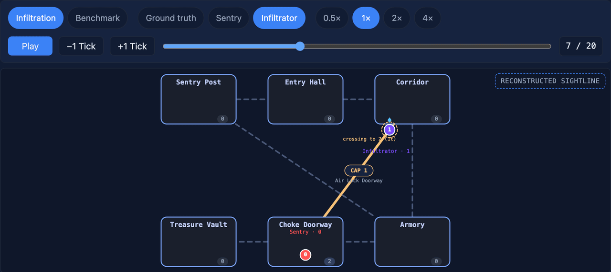

<p align="center">
  
</p>

# Lattice

<p align="center"><strong>A deterministic multi-agent environment for auditable agent benchmarking.</strong></p>

<p align="center">
  <a href="https://github.com/candavere/lattice/actions/workflows/ci.yml"></a>
  <a href="https://github.com/candavere/lattice/actions/workflows/benchmarks.yml"></a>
  <a href="https://github.com/candavere/lattice/actions/workflows/pages.yml"></a>
  
</p>

<p align="center">
  
</p>

## What Lattice is

Multi-agent claims live on a spectrum between "we ran it once somewhere" and
"here is the run, the seed, and the reproducible harness". Lattice is built for
the second end. It is a headless .NET 8 environment for deterministic
Dec-POMDP-style experiments under partial observability, dynamic topology, and
resource contention: a run is a pure step contract, each tick a function of the
prior state and the recorded actions, with no hidden state, no singletons, and
no ambient randomness. Every command is seeded, so a run is a stable object you
can inspect, fork from tick K, or hand to a reviewer.

The environment is the product and policies are evaluation subjects. Lattice is
an auditable research and benchmarking environment, not game middleware or a
game-AI product, and MCTS is one evaluation subject here, not the product. A
negative result is first-class evidence, not something to hide: the committed
32-rollout MCTS study **loses** to a deterministic heuristic, that loss is the
baseline any future policy must beat, and it is published with its confidence
interval. See [Results](#results).

The data flow, drawn from the committed tools:

```
simulate -> recording (.jsonl) -> replay --verify / render / analyze / site
benchmark -> throughput JSON          evaluate -> evaluation JSON
```

The full diagram is [`docs/architecture.svg`](docs/architecture.svg):

<p align="center">
  
</p>

Where each box in that diagram is implemented, at this commit:

| Box | Implementation |
| --- | --- |
| `lattice simulate` | `Cli/CliApp.cs:218`; the header is stamped with the current schema at `Trajectories/TrajectoryWriter.cs:47` |
| `recording .jsonl` (schema 3) | `Trajectories/TrajectoryModel.cs:21`; one header line, one line per tick, one final line |
| `lattice replay --verify` | `Cli/CliApp.cs:221`; per-tick result and state-digest comparison at `Trajectories/TrajectoryReplay.cs:169-183` |
| `lattice render` | `Cli/CliApp.cs:219`, over `Visualization/` |
| `lattice analyze` | `Cli/CliApp.cs:220`, over `Analytics/` |
| `site/ replay viewer` | `site/app.js`, deployed by `.github/workflows/pages.yml` |
| `lattice benchmark` | `Cli/CliApp.cs:222`; five workloads on fresh simulations, never on a recording |
| `throughput JSON` | the regression gate arms only on a full host match, at `.github/workflows/compare_benchmarks.py:163-165` |
| `lattice evaluate` | `Cli/CliApp.cs:223`; the pass/fail verdict is composed at `Agents/PairedEvaluation.cs:145-150` |
| `lattice evaluate --agent-cmd` | the candidate seat, with the command line split without a shell at `Cli/CliApp.cs:808`; the child process is launched from `Agents/External/ExternalAgentLaunch.cs:84` |
| `tests + fixtures` → `CI on 3 operating systems` | the golden-trajectory replay gate runs on every matrix OS at `.github/workflows/ci.yml:32` |

[Replay the infiltration recording in your browser](https://candavere.github.io/lattice/).
The page replays committed recordings only: ground truth shows everything a
recording carried, and an agent view dims what that agent could not have
reached. Nothing is recomputed from a new simulation in your browser.

## Bring your own agent

Lattice speaks a normative, language-neutral wire protocol over stdin/stdout, so
**any language that speaks the protocol** can play it: Python, Rust, Go, C++,
Java. The contract is
[`docs/EXTERNAL_AGENT_PROTOCOL.md`](docs/EXTERNAL_AGENT_PROTOCOL.md); the
complete worked example is
[`examples/python/lattice_agent.py`](examples/python/lattice_agent.py), about 150
lines of standard-library Python with no dependencies.

Here is the entire policy that example agent plays, quoted verbatim from
[`examples/python/lattice_agent.py:79-104`](examples/python/lattice_agent.py):

```python
def decide(observation):
    """The single action for this observation: pure, so the same observation
    always produces the same action and a run is reproducible from its seed."""
    mine = next(s for s in observation["agent_states"] if s["agent_id"] == observation["agent_id"])
    step = observation["step"]

    # Mid-crossing the agent is on an edge, not at a node: zone_id is still the
    # departure node and transit describes the crossing. The honest action is to
    # wait (spec 5.4).
    if "transit" in mine:
        return {"type": "action", "step": step, "kind": "Wait"}

    here = mine["zone_id"]
    claimed = set(observation["claims"])
    wanted = [r for r in observation["map"]["resources"] if r["id"] not in claimed]

    # Standing on one, so take it. Collect carries no zone_id: the wire must not
    # include a field the action would ignore (spec section 6.1).
    for resource in sorted(wanted, key=lambda r: r["id"]):
        if resource["zone_id"] == here:
            return {"type": "action", "step": step, "kind": "Collect", "resource_id": resource["id"]}

    hop = first_hop(adjacency(observation["map"]), here, {r["zone_id"] for r in wanted})
    if hop is None:
        return {"type": "action", "step": step, "kind": "Wait"}  # nothing reachable left
    return {"type": "action", "step": step, "kind": "Move", "zone_id": hop}
```

Score it with the ordinary `evaluate` command, naming your program instead of the
in-process candidate:

```sh
dotnet run --project Cli -- evaluate --scenario standard --seed-set dev --seeds 30 \
  --agent-cmd "python3 examples/python/lattice_agent.py"
```

That is the whole command. The measured result, recorded in
[`examples/python/README.md`](examples/python/README.md) at commit `c8417f0` on
2026-09-27, is the same agent **failing** the standard suite and **passing** the
bottleneck suite:

| | `--scenario standard` | `--scenario bottleneck` |
| :--- | :--- | :--- |
| valid seeds | 30 | 30 |
| void runs | 0 | 0 |
| agent failures | none | none |
| mean paired delta | −0.383 | +1.733 |
| 95% CI | [−0.672, −0.095] | [+1.424, +2.042] |
| win / draw / loss | 38.3% / 23.3% / 38.3% | 63.3% / 0.0% / 36.7% |
| contention | 0.0% | 30.1% |
| verdict | **Fail** | **Pass** |

The same policy, the same 30 seeds, one map family apart. Neither number is a
claim about the agent's quality; they are what the harness reports, and the
harness is the thing you should be checking. That inversion is the same one the
in-process MCTS study shows in [Results](#results).

## Claims and proofs

Every claim on this page has a command you can run and a committed artifact it
rests on. All commands were run at the commit that introduced this page on
macOS 27.0.0 arm64, .NET 10.0.12, 8 cores; the output fragments below are
verbatim.

| Claim | Verify with | Rests on |
| :--- | :--- | :--- |
| Same seed, same arguments, same bytes. | `dotnet run -c Release --project Cli -- simulate --seed 42 --scenario infiltration --steps 100 --out a.jsonl` twice, then `shasum -a 256 a.jsonl b.jsonl` | Both runs hash to `fe213bd5…d57f3f5`, which is the committed [`site/infiltration.jsonl`](site/infiltration.jsonl). `--seed 43` hashes to `18994817…9e8cd`. |
| Replay is hash-verified, not just re-run. | `dotnet run -c Release --project Cli -- replay Tests/fixtures/golden_trajectory.jsonl --verify` | `replay verified: 12 step(s) serialized-equivalent, 12 state hash(es) matched (seed 2024, schema v3).` Exit 0. Digest computed by [`Trajectories/SimulationStateHash.cs`](Trajectories/SimulationStateHash.cs), compared in [`Trajectories/TrajectoryReplay.cs`](Trajectories/TrajectoryReplay.cs). |
| The same check runs on all three operating systems. | Read the `Build & test` matrix in [`.github/workflows/ci.yml`](.github/workflows/ci.yml) | The golden replay-verify step is a matrix step over `ubuntu-latest`, `windows-latest`, `macos-latest`; run [36302783294](https://github.com/candavere/lattice/actions/runs/36302783294) shows all three green. |
| Every committed recording replays, not just the golden one. | `dotnet run -c Release --project Cli -- replay site/demo.jsonl --verify` and the same for `site/infiltration.jsonl` | `27 step(s) … 27 state hash(es) matched` and `20 step(s) … 20 state hash(es) matched`. A separate CI job replays every recording under `site/`. |
| The suite is green. | `dotnet test Lattice.sln -c Release` | `Passed! - Failed: 0, Passed: 711, Skipped: 0, Total: 711`. |
| A paired study needs 30 seeds, and the rule is mean > 0 **and** CI lower > 0. | `dotnet run -c Release --project Cli -- evaluate --scenario standard --seed-set dev --seeds 29 --agent-cmd "python3 examples/python/lattice_agent.py"`, then the same with `--seeds 30` | `--seeds 29` → `Not graded: 29 seeds is below the 30-seed floor of the decision rule (the canonical suites run 50).` `--seeds 30` → `Fail: mean paired delta -0.383 and/or the 95% CI lower bound -0.672 did not clear 0 on 30 seeds.` The rule is [`Agents/PairedEvaluation.cs:144-145`](Agents/PairedEvaluation.cs): `graded = deltas.Length >= 30` and `passed = graded && mean > 0.0 && ciLower > 0.0`, with `ConfidenceLevel = 0.95` at line 74. |
| Every protocol failure is a loss, never a retry. | `dotnet run -c Release --project Cli -- evaluate --scenario standard --seed-set dev --seeds 2 --agent-step-timeout-ms 300 --agent-cmd "python3 crash.py"`, where `crash.py` is `import sys; sys.exit(3)` | `"AgentFailures": {"agent_crashed": 4}`, `VoidRuns: 0`, wins/draws/losses `0/0/4` of 4. The reason set is the closed fourteen-code table at [`docs/EXTERNAL_AGENT_PROTOCOL.md` §8](docs/EXTERNAL_AGENT_PROTOCOL.md) and [`Protocol/ProtocolReasons.cs:17-30`](Protocol/ProtocolReasons.cs); thirteen are agent-attributable and one, `host_limit`, is host-attributable. |
| A failed match forfeits: external side 0, opponent keeps its score, partials are diagnostic only. | An agent that plays normally, then `sys.exit(3)` at step 10, over 3 seeds | `AgentForfeits` rows read `"PartialScoreAtSlot0": 2, "PartialScoreAtSlot1": 3, "ScoredExternalScore": 0, "ScoredOpponentScore": 3` — the external side's 2 and 3 are recorded but not scored, and the opponent keeps 3 and 2. `AgentFailures: {"agent_crashed": 6}`, all 6 matches losses, mean delta −2.333. |
| A bad `--agent-cmd` is a usage error, not a lost result. | `dotnet run -c Release --project Cli -- evaluate --scenario standard --seed-set dev --seeds 2 --agent-cmd "definitely-not-a-real-binary-xyz"` | Exit **2**, `error: --agent-cmd could not be run: 'definitely-not-a-real-binary-xyz' was not found on PATH.` [`Cli/UsageError.cs:29`](Cli/UsageError.cs) sets `ExitCode = 2`, mapped at [`Cli/CliApp.cs:1326`](Cli/CliApp.cs). |
| The published negative result is negative. | `python3 -c "import json;print(json.load(open('benchmarks/mcts_evaluation_results.json'))['Studies'][0]['Statistics'])"` | dev: mean −1.12, CI [−1.37, −0.87], 50 seeds, `Passed: false`. held-out: mean −1.25, CI [−1.54, −0.96], `Passed: false`. Committed at source revision `5783ca1`, .NET 10.0.10. |

The four gates the code actually enforces are spelled out with file and line in
[Verify everything yourself](#verify-everything-yourself).

## Results

Each row is one committed benchmark claim, with the artifact behind it.

| Finding | Artifact |
| :--- | :--- |
| 32-rollout MCTS loses to the deterministic Scout heuristic on standard generated maps: mean paired delta -1.12, 95% CI [-1.37, -0.87] on the dev suite. This loss is the committed negative baseline. | [`benchmarks/mcts_evaluation_results.json`](benchmarks/mcts_evaluation_results.json) |
| The same 32-rollout MCTS policy wins when both agents are funneled through capacity-1 chokepoints into one shared vault: +2.03, CI [+1.66, +2.41] on the dev suite. Topology changed the conclusion. | [`benchmarks/bottleneck_evaluation_results.json`](benchmarks/bottleneck_evaluation_results.json) |
| 99.61% scoped mutation score on `Simulation.cs` + `PerceptionFilter.cs` only (252 killed / 1 timed out / 1 survived / 0 no-coverage). Not whole-repository coverage. | [`benchmarks/mutation_stryker_summary.json`](benchmarks/mutation_stryker_summary.json) |
| Five-workload throughput record on one host: median 14,916 to 899,075 steps/s depending on workload (the MCTS case reports decisions/s). Speed is measured, not advertised. | [`benchmarks/throughput_benchmark.json`](benchmarks/throughput_benchmark.json), [`benchmarks/throughput_summary.md`](benchmarks/throughput_summary.md) |

### The standard study: a committed loss

The reference result for the standard study is
[`benchmarks/mcts_evaluation_results.json`](benchmarks/mcts_evaluation_results.json):
source revision `5783ca1`, .NET 10.0.10, MCTS 32 rollouts
x depth 12, 2 agents / 200 ticks / transit speed 4, baseline
`ScoutCollectorAgent` with unbounded vision, mirror-seated per seed. The
protocol facts are reproduced by `Cli/CliApp.cs` (evaluation config) and
`Agents/MctsAgent.cs` (default search depth).

| Suite | Seeds | Mean delta | 95% CI | Win | Draw | Loss | Timeout | Verdict |
| :--- | ---: | ---: | :--- | ---: | ---: | ---: | ---: | :--- |
| dev (1001-1050) | 50 | -1.12 | [-1.37, -0.87] | 15% | 27% | 58% | 0% | **FAIL** |
| held-out (2001-2050) | 50 | -1.25 | [-1.54, -0.96] | 18% | 14% | 68% | 0% | **FAIL** |

The entire 95% CI sits below 0 on both suites, so the decision rule fails by a
wide margin. Every suite run terminates at `resources-exhausted` on at most
200 ticks; contention stays at 0, because generated maps never put both agents
on the same claim path. This measures policy speed on open layouts: the
scout's back-pressure-aware collection beats this budget's shallow lookahead.

**This failure is the committed baseline.** Any future search or learning
policy must clear the rule (mean paired delta > 0 and CI lower bound > 0) on
the same suites, seeds, and budget to supersede it. To challenge the result:
raise the budget (`--rollouts 64`), change the map distribution, or swap the
baseline, and every run records its own delta, CI, and verdict.

### The bottleneck study: the same policy, the other verdict

The reference result for the bottleneck study is
[`benchmarks/bottleneck_evaluation_results.json`](benchmarks/bottleneck_evaluation_results.json):
source revision `28c89d3`, identical policy budget and baseline, procedural
contention topology family, first 30 dev + 30 held-out seeds.

| Suite | Seeds | Mean delta | 95% CI | Win | Draw | Loss | Timeout | Contention | Verdict |
| :--- | ---: | ---: | :--- | ---: | ---: | ---: | ---: | ---: | :--- |
| dev (1001-1030) | 30 | +2.03 | [+1.66, +2.41] | 50% | 3% | 47% | 0% | 16% | **PASS** |
| held-out (2001-2030) | 30 | +2.60 | [+2.20, +3.00] | 50% | 18% | 32% | 0% | 16% | **PASS** |

Each seed draws a distinct topology, while both spawn arms stay geometric
mirror images, so both agents reach the shared single-lane gate on the same
tick and actively contend. Under that pressure the same MCTS budget wins.
Relative to the pre-fix record (measured at `1c6fa80`), the re-anchored
run's mean delta rose while its match win rate fell: dev 0.55 → 0.50 (losses
22 → 28) and held-out 0.533 → 0.50 (losses 14 → 19), of 60 matches each, read
from the artifacts. This
does **not** supersede the standard-suite negative baseline; the two are
complementary evidence on different map distributions.

### Performance, qualified

The committed
[`benchmarks/throughput_benchmark.json`](benchmarks/throughput_benchmark.json)
records five workloads, raw stepping, mixed static facility, dynamic
contention, stress topology, and MCTS decisions, on a single reference host
(.NET 10.0.12 Release, Workstation GC, tree
`41530ef`, baseline re-anchored to a conservative full-protocol session on
the current runtime). Numbers come from a single reference host; its full
metadata (CPU, cores, OS, runtime) is recorded in the artifact. Median
throughput spans from 14,916 steps/s on the
30-zone stress case to 899,075 steps/s on the micro case; the MCTS case
reports decisions/s.
The per-workload latency and allocation breakdowns, the protocol, and the
honest-reading notes are in
[`benchmarks/throughput_summary.md`](benchmarks/throughput_summary.md) and
[`docs/BENCHMARKING.md`](docs/BENCHMARKING.md). Numbers vary with hardware and
build profile.

## Verify everything yourself

All commands run from a clean checkout at the repository root with the .NET 8
SDK installed, and require no network access once dependencies are restored.
You need the [.NET 8 SDK](https://dotnet.microsoft.com/download); Lattice also
runs on .NET 9/10 via `RollForward=LatestMajor`.

```sh
./setup.sh              # macOS/Linux: verify SDK, restore, build, test,
                        # reproduce one committed claim. Windows: .\setup.ps1
dotnet test Lattice.sln -c Release
dotnet run -c Release --project Cli -- replay Tests/fixtures/golden_trajectory.jsonl --verify
dotnet run -c Release --project Cli -- replay site/demo.jsonl --verify
dotnet run -c Release --project Cli -- replay site/infiltration.jsonl --verify
dotnet run -c Release --project Cli -- evaluate --seed-set dev,heldout --scenario standard --seeds 50 --rollouts 32
dotnet run -c Release --project Cli -- evaluate --seed-set dev,heldout --scenario bottleneck --seeds 30 --rollouts 32
dotnet run -c Release --project Cli -- benchmark
```

`setup.sh` and `setup.ps1` also run a one-command reproduce: they run one
existing benchmark or replay command and compare its output to the committed
artifact, printing `Reproduced: <claim> matches <artifact>` or a clear
mismatch. They are idempotent, use no `sudo`, and never install system
software. `make setup` is equivalent on macOS/Linux.

A pass prints `replay verified` and exits 0. Reproducing the committed
evaluation artifacts is documented in
[`docs/SUPPORT_AND_REPRODUCIBILITY.md`](docs/SUPPORT_AND_REPRODUCIBILITY.md)
(section 5), and the turnkey external-reviewer path, pinned to the published
`v3.0.0` release, is [`docs/reproduction_packet.md`](docs/reproduction_packet.md).

### The gates, and where the code is authoritative

Where this page describes a gate, the code is authoritative and the reference
below is exact (file and line). Two places where a committed doc and the code
disagree are called out below rather than resolved.

- **Evaluation verdict gate.** A paired study passes only when both conditions
  hold: the mean paired delta is strictly positive **and** the lower bound of
  the 95% two-sided t-confidence interval is strictly positive, on at least 30
  seeds. `Agents/PairedEvaluation.cs:144-145` enforces
  `graded = deltas.Length >= 30` and `passed = graded && mean > 0.0 &&
  ciLower > 0.0`; the interval uses `ConfidenceLevel = 0.95`
  (`Agents/PairedEvaluation.cs:74`, computed at line 127). The committed
  artifacts carry the resulting `Passed` and `Decision` fields. The protocol
  doc describes exactly this rule
  ([`docs/SUPPORT_AND_REPRODUCIBILITY.md`](docs/SUPPORT_AND_REPRODUCIBILITY.md),
  section 5), so doc and code agree here.
- **Replay equivalence gate.** `.github/workflows/ci.yml:31-32` runs
  `dotnet run -c Release --project Cli -- replay Tests/fixtures/golden_trajectory.jsonl --verify`
  on Ubuntu, macOS, and Windows. `Trajectories/TrajectoryReplay.cs`
  (`VerifyDetailed`) rebuilds a fresh simulation from the trajectory header,
  re-feeds each recorded turn, compares re-serialized `StepResult`s against the
  recorded ones, **and** recomputes the SHA-256 digest of the complete
  simulation state at every tick (`Trajectories/SimulationStateHash.cs`) and
  compares it to the digest the step line records, naming the first mismatched
  tick. This is per-step serialized equivalence plus per-tick state-digest
  equality, not raw byte identity, and the digest covers the state rather than
  the header's configuration. A recording made before schema 3 carries no
  per-tick digest, verifies on step results alone, and prints
  `no state hash: step-level verification only`; a recording that *claims*
  schema 3 but has no digest is reported as a discrepancy, so stripping the
  hashes is not a way to downgrade the check.
- **Benchmark regression gate.** `.github/workflows/benchmarks.yml:77-108`
  re-benchmarks the five-case matrix and compares it against the committed
  baseline with `compare_benchmarks.py`, failing when a current workload
  median falls below its threshold times the baseline median. The explicit
  thresholds in the workflow are 0.75 global, 0.6 for `micro_raw_2agent`, and
  0.85 for `policy_lookahead_mcts_32` (`benchmarks.yml:88-90`); otherwise the
  threshold is derived statistically from the baseline's own dispersion
  (`.github/workflows/compare_benchmarks.py:96-112`), with the CLI default
  floor at 0.8 (`compare_benchmarks.py:313`). The gate adjudicates only when
  the host fingerprint (OS family + architecture + .NET runtime major +
  logical cores + CPU model, trimmed and case-folded; a missing or empty
  host field is also a mismatch) matches
  (`compare_benchmarks.py:150-213`), and it re-measures once to rule
  out shared-runner jitter (`benchmarks.yml:94-108`). GitHub-hosted runners
  are a different host class than the
  baseline record, so they get an informational cross-host
  comparison plus the structural checks — the strict throughput verdict is
  reserved for a matching host class. The measured artifact is uploaded with
  `if: always()` (`benchmarks.yml:111-119`) so runner numbers survive a
  failed gate without log access.
  **Doc-vs-code conflict:** this README previously described the gate as
  failing on "a >20% regression", and
  [`benchmarks/throughput_summary.md`](benchmarks/throughput_summary.md) still
  does. The enforced ratios above are 0.75, 0.6, and 0.85 plus per-workload
  derived tolerances, which do not all equal a 20% drop. Both statements are
  recorded here; the workflow and comparator are the authority.
- **Mutation gate.** `stryker-config.json:22-26` sets Stryker thresholds
  `high: 80`, `low: 60`, `break: 0`. The only threshold the tool enforces is
  `break`, so the committed gate fails only at a 0% score; `high`/`low` are
  informational. There is no mutation step in CI (`.github/workflows/ci.yml`
  runs restore, build, replay-verify, test, the UI regression, and a second job
  that replays every `site/` recording). The
  99.61% figure is a committed calibration record, not a CI gate.

### Determinism and seeds

Every command is seeded. Identical arguments produce identical per-step
serialized output under the specified .NET 8 BCL runtime contract. The
repository makes four distinct guarantees, documented in
[`docs/SUPPORT_AND_REPRODUCIBILITY.md`](docs/SUPPORT_AND_REPRODUCIBILITY.md):
engine transition determinism, per-step serialized `StepResult` replay
equivalence, same-host normalized JSONL byte identity (narrow and explicit),
and the per-tick canonical state digest — the last covering the state each tick
produced, not a whole-episode hash tree. Raw file-byte
identity across heterogeneous hosts is not asserted. The formal,
implementation-agnostic transition and perception laws, plus falsifiable
challenge questions, are in
[`docs/INVARIANT_SPECIFICATION.md`](docs/INVARIANT_SPECIFICATION.md).

`replay --verify` is the contract that makes those claims checkable rather than
asserted. It rebuilds a fresh simulation from the trajectory header, feeds each
recorded turn of actions back through the engine, compares every re-serialized
`StepResult` against the recorded one, recomputes each step's state digest and
compares that, and re-computes the final summary line's aggregates field by
field; exit code `0` means every tick and the final aggregates reproduced. That
is the same check the CI pipeline runs on the golden trajectory on Ubuntu,
macOS, and Windows, and on every recording under `site/` in one further job.

`infiltration.jsonl` is one JSONL line per tick: the header embeds the seeded
map and simulation config, and each line is that tick's recorded actions and
`StepResult`, plus the SHA-256 digest of the world state that tick produced. The
SVG is a self-contained animated render:

```sh
dotnet run --project Cli -- simulate --seed 42 --scenario infiltration --steps 100 --out infiltration.jsonl
dotnet run --project Cli -- render --trajectory infiltration.jsonl --format svg --out infiltration.svg
```

### Negative results, recorded rather than smoothed

Only claims the repository can back up are listed here.

- **The standard-suite loss is committed, not a bug.** The 32-rollout MCTS
  policy loses to the deterministic Scout heuristic on standard generated maps
  (`benchmarks/mcts_evaluation_results.json`). It is the baseline any future
  policy must beat under the identical protocol.
- **What the site calls "fog" was never recorded.** The committed recordings,
  including `site/demo.jsonl` and `site/infiltration.jsonl`, were captured by
  the study suite with unbounded vision (`Vision = -1` in the recording
  header), so the engine never recorded a fog field. The dashed sightline the
  agent view draws is a reconstruction by the page, computed from recorded
  positions with a 2-hop rule ("which rooms could a 2-hop agent see?"). The
  vault therefore never "drops out of view"; it **drifts out of the
  reconstructed sightline**. In the committed infiltration recording, on the
  page's own tick numbering, the vault goes "last known" on the Infiltrator view
  at ticks 9, 19 and 20, and on the Sentry view only at tick 20 — the
  mid-episode Sentry window the page's guided callout points at is not in this
  file
  ([`site/index.html`](site/index.html), [`site/infiltration.jsonl`](site/infiltration.jsonl)).
- **Per-tick state hash.** `replay --verify` recomputes a SHA-256 digest of
  the full simulation state at every tick — zone and resource positions,
  occupancy, the per-tick choke capacities and derived edge load, scores,
  claims, the episode seed and the tick — from a canonical, fixed-field-order,
  invariant-culture serialization (`Trajectories/SimulationStateHash.cs`), and
  compares it to the digest recorded on each step line. Positions are included
  because they are state, not rendering: `Simulation.TransitTicks` reads
  `Zone.Position` for a crossing's kinematic length, and the perception filter
  reads both positions to build the observations a step line carries. Only the
  demonstration-layer `Role` labels are excluded, since the step contract never
  reads them. The digest does not cover the header's simulation config or
  dynamic-rule set, so it attests to the state each tick produced rather than
  to the whole episode configuration. The benchmark harness's FNV-1a step digest
  remains an internal warm-up anchor, unrelated to this canonical hash.
- **Stepping is not zero-allocation.** Managed step allocations range from
  roughly 3.2 KB to 7.1 KB per tick on the raw, facility, and dynamic
  workloads, and substantially more on the stress and MCTS workloads;
  `benchmarks/throughput_summary.md` carries the measured values. No "0 bytes
  allocated" claim is made.
- **Policy quality is topology-conditional.** MCTS wins the bottleneck study
  and loses the standard one; neither verdict describes the policy uniformly.
  The Python example agent does the same, in [Bring your own
  agent](#bring-your-own-agent).
- **Site recordings are re-recorded, not historical.** `site/demo.jsonl` and
  `site/infiltration.jsonl` were re-recorded on the current engine from the
  seed and config their own headers and the page's reproduce commands name, so
  `replay --verify` passes on both, state hashes included, and a CI job gates
  every recording under `site/`. They are not the files the page first shipped:
  engine changes since 2026-09-17 (the `Observation.StepNumber` field, the
  tick-rotated choke arbitration, and the instant/one-tick crossing gate) moved
  both episodes earlier — the demo now ends at tick 27 instead of hitting the
  30-tick cap, and the infiltration run at tick 20 instead of 23. Re-running the
  documented commands on any later engine revision can move them again, and the
  CI job is what catches it.

## Known limitations

- At a 390px viewport the replay viewer's room titles render at roughly 6.5px.
  The infiltration map is three columns of rooms, and a phone canvas is about
  318px wide, so the cards are scaled to fit rather than overlapped: every
  title and agent name is complete, inside its room, and legible, but small.
  Wider viewports render the same map at the full 11px.
- A seed with one completed match and one void refuses the study: there is no
  drop-and-count yet. `Agents/PairedEvaluation.cs:100-105` throws when a seed is
  missing one side of the mirrored pair, and a void run produces no match row
  at all.
- Replay verifies the recorded environment actions; it cannot reproduce a
  nondeterministic external agent's decisions. Such an agent yields a different
  trajectory from the same seed on every run, and `replay --verify` still
  succeeds on each one.
- Exit code 2 is reserved for `--agent-cmd` usage errors. An unknown flag on
  `evaluate` still exits 1, like every other command and every other usage
  error, so the two are not the same channel.
- Timing bounds are calibrated on an Apple M1 and are far from binding: the
  default step budget is 5000 ms and the whole-match budget is
  `5000 × max_ticks + 30000` ms. They were not measured on slower runners.
- The `TempFile` test helper swallows an `IOException` on delete and leaves the
  file, so a refused delete is not a test failure. Real handle leaks are caught
  directly, by asserting the exclusive-open property, in
  `ExternalAgentFileHandleTests`.
- `benchmarks/throughput_summary.md` describes the regression gate as failing on
  a `>20%` drop while this page describes the enforced ratios of 0.75, 0.6, and
  0.85. The conflict is recorded, not reconciled; the workflow and comparator
  are authoritative.

## Repository layout

- `Cli/` - the `lattice` command surface: `generate`, `simulate`, `render`,
  `analyze`, `replay`, `benchmark`, `evaluate`.
- `Environment/` - the pure step contract: `Simulation`, `PerceptionFilter`,
  dynamic topology rules.
- `Generator/` - seeded procedural maps with a caller-supplied fairness gate.
- `Agents/` - evaluation subjects (MCTS, Scout), the mirrored-seat paired
  evaluation, and the external-agent match runner.
- `Protocol/` - the external-agent wire types, a leaf that references nothing in
  this repository.
- `Trajectories/` - the JSONL recording model, writer, reader, and replay
  verifier.
- `Analytics/` - the benchmark harness and analysis.
- `Visualization/` - the SVG/ASCII renderer.
- `Tests/` - unit, determinism, property, and fuzz suites plus the golden
  fixtures.
- `benchmarks/` - the committed JSON artifacts every number above comes from.
- `docs/` - ADRs, the invariant specification, protocols, the findings
  ledger, and the claim calibration matrix.
- `examples/` - worked external agents; `examples/python/` is a conformant
  standard-library agent.
- `site/` - the browser replay viewer deployed to GitHub Pages; it reads
  committed `.jsonl` recordings.
- `ui_tests/` - the tracked Playwright regression for the demo page.

The assembly map and how the layers fit together are in
[`docs/ECOSYSTEM.md`](docs/ECOSYSTEM.md). The engine mechanics and their
enforcement tests are in [`docs/MECHANICS.md`](docs/MECHANICS.md).

## Reference

`Lattice.Cli` exposes seven commands (`Cli/CliApp.cs`). Run any of them with
`dotnet run --project Cli -- <command> ...`; the binary name is `lattice`.
Every command is seeded, and exit status is 0 on success, non-zero on a bad
argument or runtime error.

| Command | Purpose | Key flags |
| :--- | :--- | :--- |
| `generate` | Write a valid seeded map | `--seed`, `--min-fairness`, `--out` |
| `simulate` | Record an episode as JSONL | `--seed`, `--steps`, `--agent`, `--scenario`, `--rules`, `--out` |
| `render` | Replay a recording as ASCII or SVG | `--trajectory`, `--format`, `--out` |
| `analyze` | Report on a recording (contention, pathing, heatmaps) | `--trajectory`, `--out` |
| `replay` | Replay and optionally verify per-step serialized equivalence and the final summary line | `<file>`, `--verify`, `--out` |
| `benchmark` | Run the five-case workload matrix | `--runs`, `--warmup`, `--commit`, `--cpu`, `--out` |
| `evaluate` | Mirror-seated paired MCTS study, or an external agent process | `--seed-set`, `--rollouts`, `--seeds`, `--scenario`, `--out`, `--agent-cmd`, `--agent-step-timeout-ms` |

`evaluate --agent-cmd "<command line>"` scores an external agent process in place
of the in-process MCTS candidate, under the same seeds, budget, and statistics;
a complete conformant agent is in
[`examples/python/`](examples/python/README.md). The command line is split
**without a shell**: unquoted whitespace separates, a double quote groups, a
backslash escapes only `"` and `\` inside quotes and is an ordinary character
everywhere else.

The flag-by-flag reference, every flag, its semantics, and worked examples,
lives in [`docs/CLI.md`](docs/CLI.md).

## How evidence works

Each committed artifact below is the exact file behind a claim on this page:

| Artifact | What it is | Sub-claims it backs |
| :--- | :--- | :--- |
| [`docs/SUPPORT_AND_REPRODUCIBILITY.md`](docs/SUPPORT_AND_REPRODUCIBILITY.md) | The operational contract: what is supported, what is not, the four-equivalence vocabulary | Replay equivalence, determinism boundary, support matrix |
| [`docs/INVARIANT_SPECIFICATION.md`](docs/INVARIANT_SPECIFICATION.md) | Formal, implementation-agnostic transition and perception laws plus falsifiable challenge questions | Capacity gates, conflict resolution, perception boundary, replay contract |
| [`benchmarks/mcts_evaluation_results.json`](benchmarks/mcts_evaluation_results.json) | Standard-map paired study, dev + held-out | Negative baseline, delta, CI, verdict |
| [`benchmarks/bottleneck_evaluation_results.json`](benchmarks/bottleneck_evaluation_results.json) | Contention-bearing paired study, dev + held-out | Topology-dependent inversion |
| [`benchmarks/throughput_benchmark.json`](benchmarks/throughput_benchmark.json) | Five-workload timing record on one host | Performance, qualified |
| [`benchmarks/mutation_stryker_summary.json`](benchmarks/mutation_stryker_summary.json) | Stryker run summary with survivor classification | Mutation score, scope |
| [`docs/reproduction_packet.md`](docs/reproduction_packet.md) | Turnkey guide to verifying the published `v2.3.2` and `v3.0.0` releases asset-for-asset | Release claims, checksums |
| [`docs/FINDINGS_LEDGER.md`](docs/FINDINGS_LEDGER.md) | Append-only record of criticisms, edge cases, and resolved issues | Governance, traceability |
| [`docs/CLAIM_CALIBRATION_MATRIX.md`](docs/CLAIM_CALIBRATION_MATRIX.md) | Every public claim mapped to its proving artifact, tested matrix, and boundary | Claim-to-artifact traceability |
| [`docs/EXTERNAL_AGENT_PROTOCOL.md`](docs/EXTERNAL_AGENT_PROTOCOL.md) | The normative external-agent wire contract, including the closed reason set and the forfeit rule | Bring-your-own-agent, failure accounting |

The reproduction packet covers the **v2.3.2** and **v3.0.0** releases. Each has
its own section with its own tag, commit, sizes, and SHA-256 checksums, taken
from the published assets of that release; the v2.3.2 section is deliberately
unchanged, so the two are verified independently rather than one being edited to
match the other.

## Trust, boundaries, and further reading

- **Development and verification method.** Lattice is developed through
  AI-assisted implementation under human direction, architectural
  specification, and review. Claims enter the repository only when they map to
  committed code, deterministic tests, CI workflows, or benchmark artifacts;
  AI assistance is an authoring method, never independent validation.
- **Research preview.** Not qualified for production or critical-infrastructure
  use. The supported matrix and operational boundaries live in
  [`docs/SUPPORT_AND_REPRODUCIBILITY.md`](docs/SUPPORT_AND_REPRODUCIBILITY.md).
- **Independent replication.** Verify the published `v3.0.0` (or `v2.3.2`)
  release asset-for-asset via
  [`docs/reproduction_packet.md`](docs/reproduction_packet.md), governed by
  [`docs/VALIDATION_PLAN.md`](docs/VALIDATION_PLAN.md).
- **Governance.** [`docs/FINDINGS_LEDGER.md`](docs/FINDINGS_LEDGER.md) records
  criticisms, edge cases, and resolved issues;
  [`docs/CLAIM_CALIBRATION_MATRIX.md`](docs/CLAIM_CALIBRATION_MATRIX.md) maps
  every public claim to its proving artifact, tested matrix, and boundary.
- **External agents.** [`docs/EXTERNAL_AGENT_PROTOCOL.md`](docs/EXTERNAL_AGENT_PROTOCOL.md)
  is the normative contract for playing Lattice as an agent from an external
  process over stdin/stdout, in any language.
- **Design decisions.** Architecture decision records in
  [`docs/adr/`](docs/adr/) explain why the contracts are shaped as they are:
  product thesis and evidentiary standards, graph-over-grid maps, the
  two-phase step resolution plus perception/transit/forking addenda, mirrored-
  seat spawn fairness, and the external-agent wire contract.
- **Related.** [Contributing](CONTRIBUTING.md) · [License](LICENSE) ·
  [Security](SECURITY.md) · [Live demo](https://candavere.github.io/lattice/).

## Citation

If you use Lattice in research, please cite it. The machine-readable record is
[`CITATION.cff`](CITATION.cff).

```bibtex
@misc{YourReferenceHere,
  author = {Mehta, Deep},
  title = {Lattice},
  year = {2026},
  url = {https://github.com/candavere/lattice}
}
```

## License

MIT — see [`LICENSE`](LICENSE).
